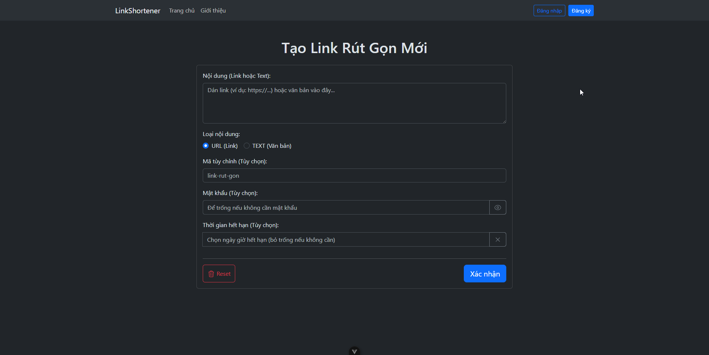
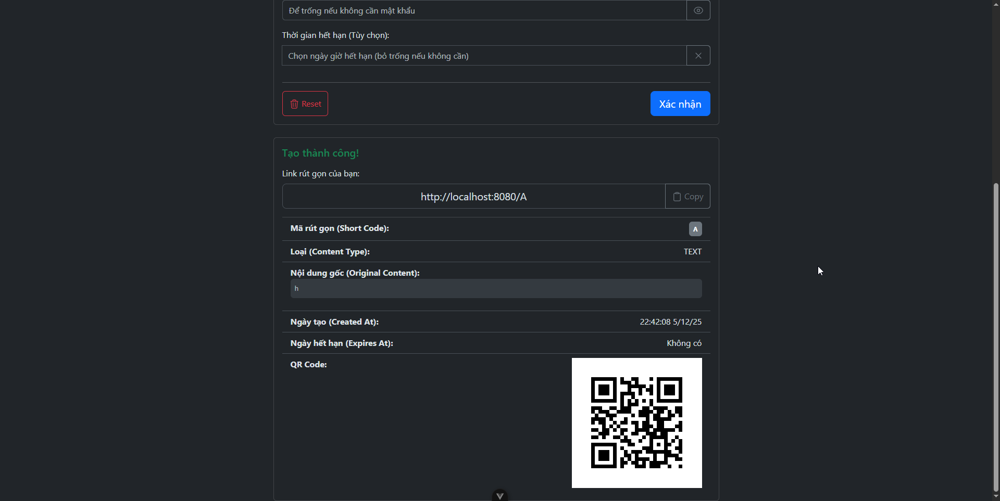
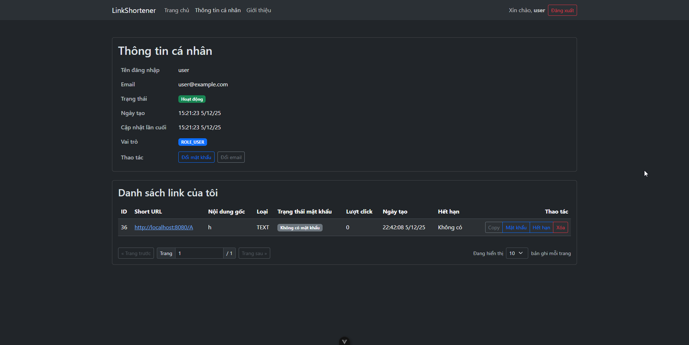
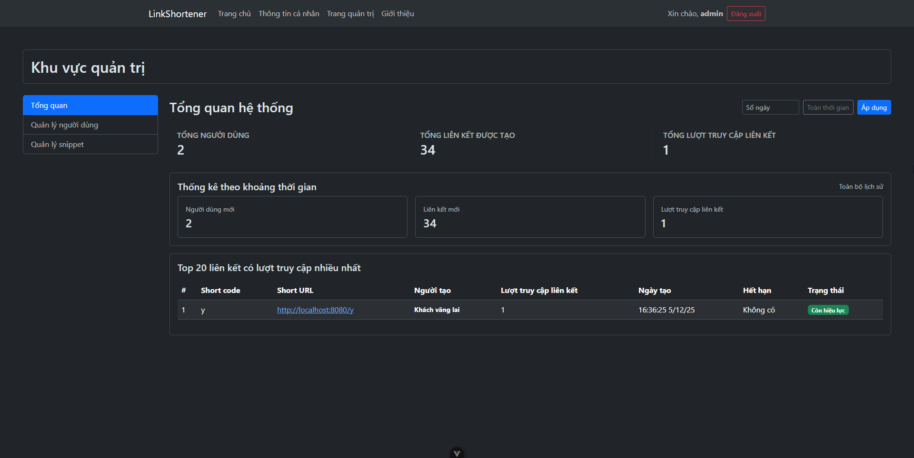
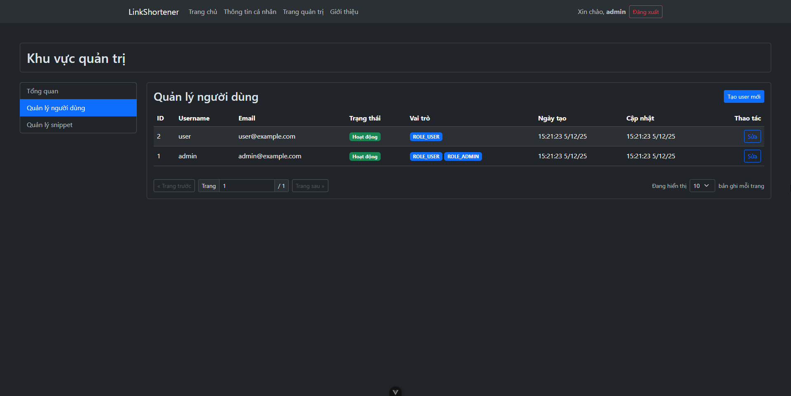
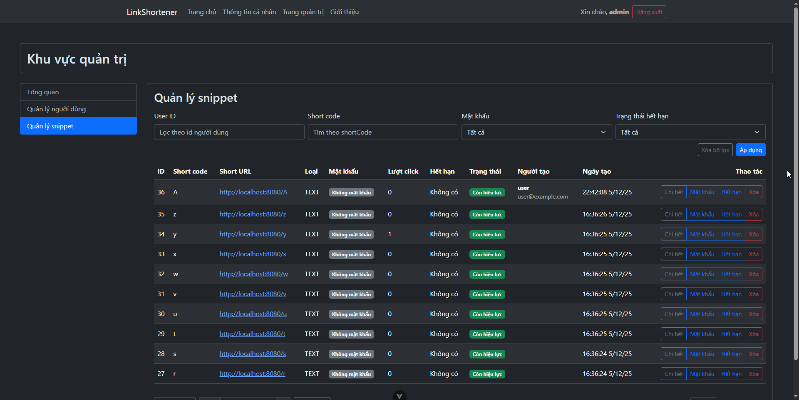
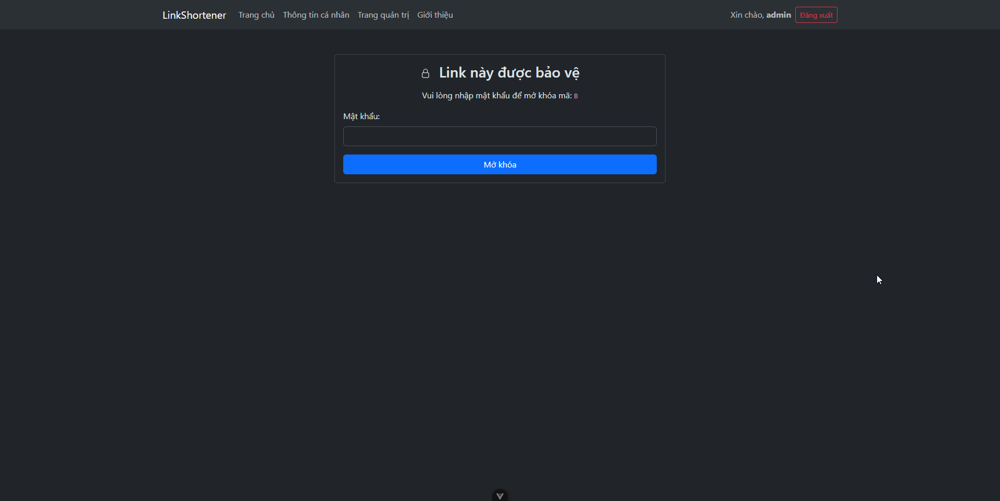
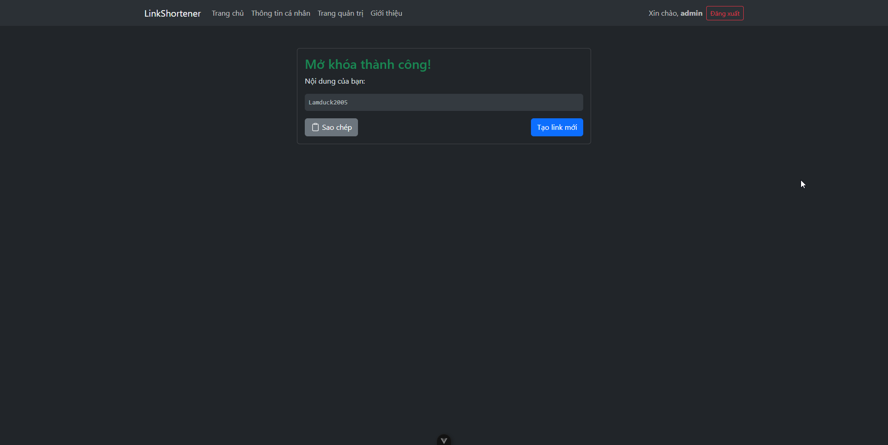

# Link Shortener – URL & Snippet Manager

An advanced URL shortening and snippet sharing application featuring password protection, expiration dates, QR code generation, and analytics. Includes a complete user management system, admin dashboard, and RESTful API ready for deployment.

## Badges


## Live Demo

**Live Demo:** [https://linkshortener-iota.vercel.app/](https://linkshortener-iota.vercel.app/)

**Frontend Project:** [https://github.com/lamduck2005/LinkShortenerVue](https://github.com/lamduck2005/LinkShortenerVue)

**API Base URL:** [https://linkshortener-goro.onrender.com/](https://linkshortener-goro.onrender.com/)

**API Documentation:** [https://linkshortener-goro.onrender.com/swagger-ui.html](https://linkshortener-goro.onrender.com/swagger-ui.html)

**Note:** The backend is hosted on **Render Free Tier**. Processing speeds may be slow due to limitations, please be patient.

## Key Features

### Core Features
- Shorten URLs and share text snippets with concise codes
- Automatically generate short codes from IDs (Base62 encoding) or use custom aliases (6-20 characters)
- Support for both guest users and authenticated users
- Personal snippet management: view list, update, and delete own snippets

### Security Features
- Password-protected snippets (BCrypt hashing)
- Expiration date configuration for snippets
- JWT Authentication for API access
- Role-based authorization (USER and ADMIN) with Spring Security
- Case-insensitive username handling

### Technical Highlights
- Automatic QR Code generation for snippets
- Analytics tracking: click counts, IP addresses, User-Agents
- Admin dashboard: overview statistics, top 20 most popular links
- RESTful API with comprehensive validation
- Database migration using Flyway
- Docker support for easy deployment

## Tech Stack

### Backend
- **Java 17** - Programming language
- **Spring Boot 3.5.7** - Core framework
- **Spring Security** - Authentication & Authorization
- **Spring Data JPA** - ORM and database access
- **PostgreSQL** - Database
- **Flyway** - Database migration
- **JWT (jjwt 0.11.5)** - Token-based authentication
- **MapStruct 1.5.5** - Object mapping
- **Lombok** - Boilerplate code reduction
- **ZXing 3.5.3** - QR Code generation
- **SpringDoc OpenAPI 2.7.0** - API documentation
- **Maven** - Build tool

### Frontend
- **Vue.js 3** - JavaScript Framework
- **Vite** - Build tool
- **Bootstrap** - UI Component Library
- **Axios** - HTTP Client

### Database
- **PostgreSQL** - Relational database

### Tools & DevOps
- **Docker** - Containerization
- **Flyway** - Database version control
- **Maven** - Dependency management

## Screenshots

### Homepage / Create Snippet Page


### Homepage / Create Snippet After Creating a Snippet


### User Information Page and List of Created Links


### System Overview Dashboard


### User Management Page


### Snippet Management Page


### Unlock Snippet with Password Page


### Snippet Content Page After Unlocking



## Architecture & Database

### Database Schema

The system utilizes 5 main tables:

1. **roles** - Stores user roles (ROLE_USER, ROLE_ADMIN)
2. **users** - Stores user information (email, username, password_hash)
3. **user_roles** - Many-to-many relationship table between users and roles
4. **snippets** - Stores snippet data (short_code, content_type, content_data, password_hash, expires_at, user_id)
5. **click_analytics** - Tracks click events (snippet_id, click_time, ip_address, user_agent)

### API Architecture

- **Public Endpoints:** Create snippet, access snippet, health check
- **User Endpoints:** Manage personal snippets, change password/email
- **Admin Endpoints:** Dashboard stats, user management, snippet management

## How to Run

### Prerequisites
- Java 17 or higher
- Maven 3.8.5 or higher
- PostgreSQL (latest version)
- Docker (optional, for containerized run)

### Manual Setup

1. **Clone repository:**
```bash
git clone https://github.com/lamduck2005/LinkShortener.git
cd LinkShortener
```

2. **Configure database:**
   - Create a PostgreSQL database
   - Update connection information in `src/main/resources/application-local.properties`

3. **Run the application:**
```bash
mvn clean install
mvn spring-boot:run
```

The application will run at `http://localhost:8080`

### Docker Setup

1. **Build Docker image:**
```bash
docker build -t link-shortener .
```

2. **Run container:**
```bash
docker run -p 8080:8080 \
  -e SPRING_PROFILES_ACTIVE=prod \
  -e DB_URL=jdbc:postgresql://host:port/database \
  -e DB_USERNAME=your_username \
  -e DB_PASSWORD=your_password \
  -e JWT_SECRET=your_jwt_secret \
  -e APP_BASE_URL=http://localhost:8080 \
  -e APP_FRONTEND_URL=http://localhost:3000 \
  link-shortener
```

## Environment Variables

When deploying (profile `prod`), configure the following environment variables:

### Database
- `DB_URL` - JDBC connection URL for PostgreSQL (e.g., `jdbc:postgresql://localhost:5432/linkshortener`)
- `DB_USERNAME` - Database username
- `DB_PASSWORD` - Database password

### Application
- `SPRING_PROFILES_ACTIVE` - Spring Boot profile (set to `prod` for production)
- `APP_BASE_URL` - Backend API base URL (e.g., `https://api.example.com`)
- `APP_FRONTEND_URL` - Frontend URL (e.g., `https://example.com`)
- `PORT` - Application port (default: 8080)

### Security
- `JWT_SECRET` - Secret key for signing JWT tokens (use a long, random, and complex string)

### Local Development
Default values are configured in `src/main/resources/application-local.properties`:
- Database: localhost:5432
- JWT Secret: default (should be changed in production)
- Frontend URL: http://localhost:3000

## API Documentation

API documentation is automatically generated by SpringDoc OpenAPI. After running the application, access:

- **Swagger UI:** `http://localhost:8080/swagger-ui.html`
- **OpenAPI JSON:** `http://localhost:8080/v3/api-docs`

## Default Accounts

When the application starts for the first time, the system automatically creates 2 test accounts:

- **Admin:** `admin` / `123456` (ROLE_ADMIN + ROLE_USER)
- **User:** `user` / `123456` (ROLE_USER)

**Note:** These 2 accounts are protected and cannot be modified.
